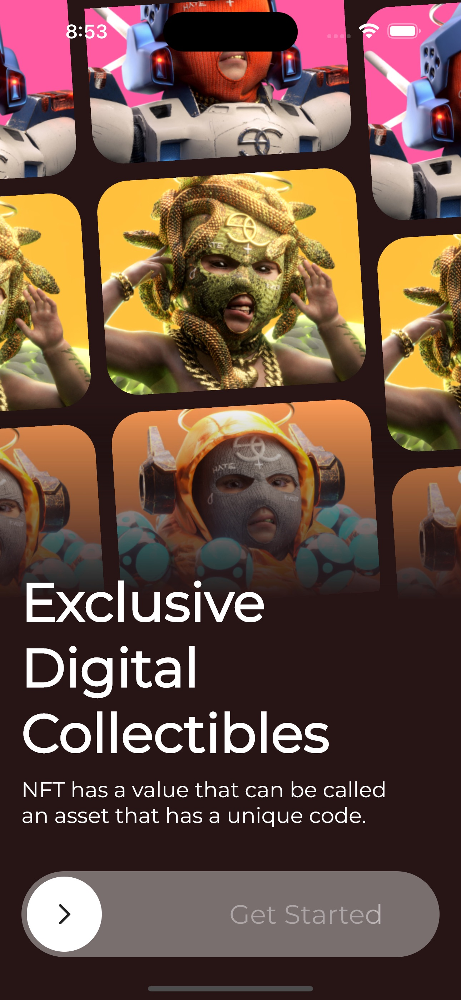
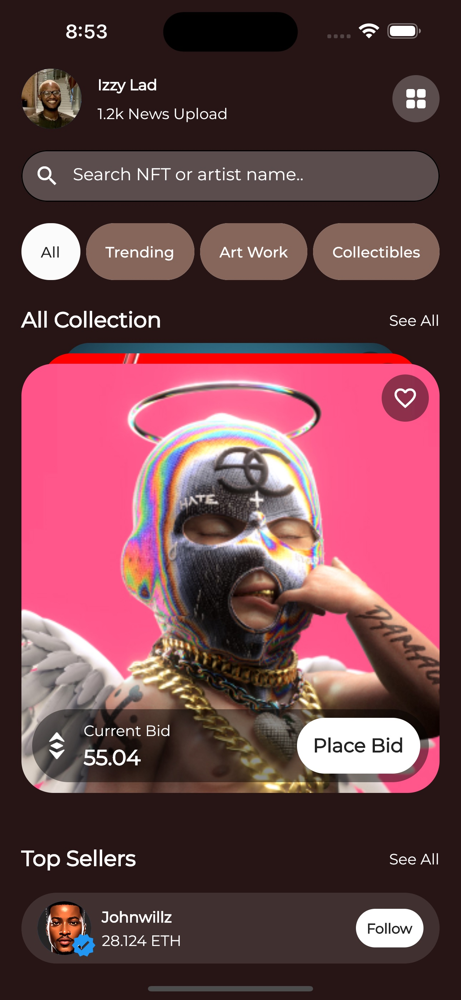

# 🖼️ NFT APP  

Flutter representation of a NFT Market place app UI i found on Dribble.
**It only consists of 2 screens.**

Star⭐ the repo if you like what you see😉.

## 📸 SnapShots

| 1 | 2|
|------|-------|
|||

| 3 | 4|
|------|-------|
|||

## Let's Connect
**Johnwillz** 

## Design Inspo Credits

